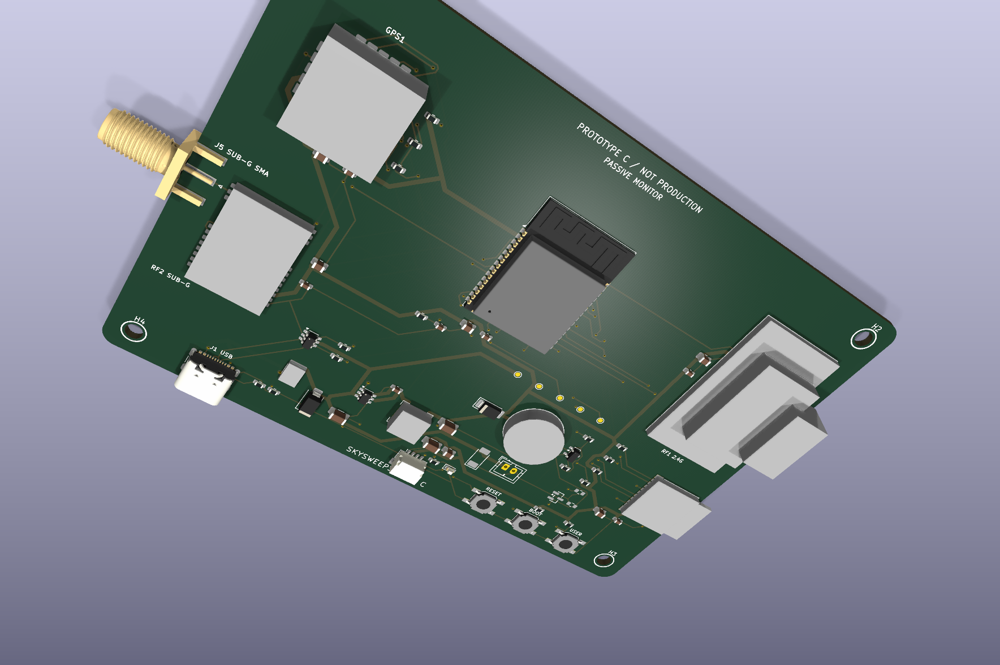

# SkySweep32

Open-source passive multi-band RF monitor and logger built around ESP32-S3.

**855–925 MHz · 2.4 GHz · 5.8 GHz · BLE/Wi-Fi · GNSS · microSD · Web UI**

[](https://github.com/bobberdolle1/SkySweep32/actions/workflows/platformio.yml)
[](https://github.com/bobberdolle1/SkySweep32/actions/workflows/hardware.yml)
[](LICENSE)

[English](#english) | [Русский](#russian)

---

<a name="english"></a>
## English

SkySweep32 Rev C combines three passive RF observation paths with local
logging, positioning, a display, battery operation, and networking in one
open-source device.

> **Rev C is the current hardware revision.** It is ready for its first
> physical prototype. No Rev C board has yet been physically bench-tested.



### Start here

- [Build Rev C](BUILD_THIS.md) — one concise route to the current prototype.
- [Hardware](hardware/rev_c/README.md) — schematic, PCB, BOM, enclosure, and
  source-of-truth hierarchy.
- [Firmware](#firmware-compatibility) — build the canonical ESP32-S3 target.
- [Roadmap](hardware/rev_c/ROADMAP.md) — physical evidence before refinement.
- [Validation](hardware/rev_c/validation/verification_summary.json) — current
  reproducible CAD/build evidence and its limits.
- [Website](https://bobberdolle1.github.io/SkySweep32/) — product overview in
  English and Russian.

### What SkySweep32 does

- **855–925 MHz:** E07-900M10S/CC1101 channelized RSSI and activity
  observation. 433 MHz is outside the Rev C contract.
- **2.4 GHz:** E28-2G4M12SX/SX1281 instantaneous-RSSI sweep with a dedicated
  internal U.FL antenna.
- **5.8 GHz:** RX5808-based eight-channel analog RSSI observation from
  5645–5945 MHz. Every procured lot needs the documented incoming check.
- **Local device functions:** GNSS logging, microSD storage, OLED status,
  buttons/buzzer, protected battery operation, native USB, Wi-Fi dashboard,
  BLE receive functions, and ESP-NOW source support.

These are passive energy/RSSI observation paths. They do not identify a
protocol or transmitter, demodulate video, provide RF direction finding, or
perform active RF interference.

### Rev C hardware

- `ESP32-S3-WROOM-1-N16R8` with native USB-C programming.
- Ebyte `E07-900M10S`, Ebyte `E28-2G4M12SX`/SX1281, and a
  procurement-qualified `RX5808-2012-12P` envelope.
- u-blox `SAM-M10Q-00B`, Molex `104031-0811` microSD socket, and Adafruit
  `PID 326` OLED on a keyed harness.
- Protected USB-C/battery power path using BQ24074, TPS61232, MAX17048, and
  AP63203WU-7 with the specified protected Adafruit `PID 328` battery.
- 150 × 95 mm four-layer PCB with a continuous L2 ground reference.
- 165.4 × 117.4 × 33.5 mm printed indoor enclosure generated around the PCBA,
  battery, display, antennas, harnesses, and M3 hardware. It is not sealed or
  IP rated.

See the [Rev C architecture](hardware/rev_c/ARCHITECTURE.md) and
[exact component manifest](hardware/rev_c/hardware_manifest.json) for the
canonical implementation.

### Capabilities and limits

`Implemented in source` is not physical validation.

| Capability | Rev C implementation | Current limit |
|---|---|---|
| 855–925 MHz observation | E07/CC1101 RSSI/activity | RF response unmeasured; no protocol identity |
| 2.4 GHz observation | E28/SX1281 instantaneous RSSI | Coarse energy/activity only; no demodulation |
| 5.8 GHz observation | RX5808 channel selection + analog RSSI | Supplier/pinout and RF response need physical checks |
| Wi-Fi / BLE | ESP32-S3 dashboard and receive functions | No physical Rev C run; Remote ID has no conformance evidence |
| GNSS / storage / display | Exact fitted modules and source support | No live-fix, endurance, or physical UI test |
| ESP-NOW | Source support | No range, coexistence, or multi-node bench test |
| TinyML | Excluded from Rev C | Legacy source has a dummy model; trained inference is not implemented |
| LoRa / Meshtastic | Excluded from Rev C motherboard | A possible future external expansion, not Rev C hardware |

### Build and validation

[BUILD_THIS.md](BUILD_THIS.md) is the builder entrypoint. It links to the
fitted BOM, fabrication package, enclosure, assembly procedure, canonical
firmware, and prototype checklist without mixing revisions.

The detailed [Rev C build guide](hardware/rev_c/BUILD.md) requires the
complete local gate before purchase:

```bash
python hardware/rev_c/verify_schematic_parity.py
python hardware/verify.py
```

The verification record includes ERC/DRC results, precise exclusion audit,
CAD interference checks, fabrication exports, and the firmware build. These
are design/CAD results only; they do not establish RF performance, reliability,
compliance, manufacturing yield, or field operation.

### Firmware compatibility

Build the current hardware from source only:

```bash
pio run -e esp32s3_rev_c_passive
pio run -e esp32s3_rev_c_passive --target upload
```

> **Do not flash `v0.6.1` binaries onto Rev C.** They target legacy ESP32 DevKit
> wiring. `esp32dev_base`, `esp32dev_standard`, `esp32dev_pro`, and
> `esp32s3_rev_b_pro` remain compile-checked only for historical regression;
> their pin maps, BOMs, enclosures, and release binaries are incompatible with
> Rev C.

### Validation and engineering history

[Validation](hardware/rev_c/validation/verification_summary.json) records the
exact tools, source revision, commands, evidence paths, ERC/DRC results, and
narrow documented exclusions. A skipped gate is recorded as skipped, never as
passed.

Rev C is the only current hardware source. [Rev B](hardware/rev_b/) is a failed
and unverified historical baseline; [Rev A](hardware/LEGACY_REV_A_STATUS.md) is
legacy parser-compatibility history. Neither may be ordered or used to build
Rev C. See the [engineering audit](hardware/ENGINEERING_AUDIT_2026-08-11.md)
for the evidence.

### License and lawful use

GNU GPL v3. Passive reception can still be regulated and can expose private or
protected information. Follow local radio, privacy, aviation, and data laws.
The canonical hardware contains no active interference functions.

---

<a name="russian"></a>
## Русский

SkySweep32 Rev C объединяет три тракта пассивного RF-наблюдения с локальным
журналированием, позиционированием, дисплеем, питанием от аккумулятора и
сетевыми функциями в одном open-source устройстве.

> **Rev C — текущая аппаратная ревизия.** Она готова к первому физическому
> прототипу. Физическая плата Rev C ещё не прошла стендовые испытания.


### Начните отсюда

- [Собрать Rev C](BUILD_THIS.md) — короткий маршрут к текущему прототипу.
- [Аппаратная часть](hardware/rev_c/README.md) — схема, PCB, BOM, корпус и
  иерархия источников истины.
- [Прошивка](#совместимость-прошивки) — сборка канонической цели ESP32-S3.
- [Дорожная карта](hardware/rev_c/ROADMAP.md) — сначала физические измерения,
  затем изменения.
- [Валидация](hardware/rev_c/validation/verification_summary.json) —
  воспроизводимые CAD/build-проверки и их ограничения.
- [Сайт проекта](https://bobberdolle1.github.io/SkySweep32/).

### Что делает SkySweep32

- **855–925 МГц:** E07-900M10S/CC1101, канальное пассивное наблюдение RSSI и
  активности. 433 МГц не входит в контракт Rev C.
- **2.4 ГГц:** E28-2G4M12SX/SX1281, обзор мгновенного RSSI с отдельной
  внутренней антенной U.FL.
- **5.8 ГГц:** RX5808, восемь каналов и аналоговый RSSI в диапазоне
  5645–5945 МГц. Каждая закупленная партия требует входного контроля.
- **Локальные функции:** GNSS-журналирование, microSD, OLED, кнопки/зуммер,
  защищённое аккумуляторное питание, native USB, Wi-Fi dashboard, приёмные
  BLE-функции и исходная поддержка ESP-NOW.

Это пассивное наблюдение энергии/RSSI. Устройство не определяет протокол или
передатчик, не демодулирует видео, не выполняет радиопеленгацию и не создаёт
активные радиопомехи.

### Аппаратная часть Rev C

- `ESP32-S3-WROOM-1-N16R8` с программированием через native USB-C.
- Ebyte `E07-900M10S`, Ebyte `E28-2G4M12SX`/SX1281 и проверяемый при приёмке
  габарит `RX5808-2012-12P`.
- u-blox `SAM-M10Q-00B`, разъём microSD Molex `104031-0811` и OLED Adafruit
  `PID 326` на ключевом шлейфе.
- Защищённый тракт USB-C/аккумулятора: BQ24074, TPS61232, MAX17048,
  AP63203WU-7 и защищённый аккумулятор Adafruit `PID 328`.
- Четырёхслойная PCB 150 × 95 мм с непрерывной землёй L2.
- Печатный корпус для помещения 165.4 × 117.4 × 33.5 мм, спроектированный
  вокруг PCBA, аккумулятора, дисплея, антенн, шлейфов и крепежа M3. Он не
  герметичен и не имеет IP-рейтинга.

Каноническая реализация описана в [архитектуре Rev C](hardware/rev_c/ARCHITECTURE.md)
и [точном манифесте компонентов](hardware/rev_c/hardware_manifest.json).

### Возможности и ограничения

`Реализовано в исходном коде` не означает физическую проверку.

| Возможность | Реализация Rev C | Текущее ограничение |
|---|---|---|
| Наблюдение 855–925 МГц | E07/CC1101, RSSI/активность | RF-отклик не измерен; протокол не определяется |
| Наблюдение 2.4 ГГц | E28/SX1281, мгновенный RSSI | Только энергия/активность; без демодуляции |
| Наблюдение 5.8 ГГц | RX5808, каналы + аналоговый RSSI | Нужны входной контроль и RF-измерения |
| Wi-Fi / BLE | Dashboard и приёмные функции ESP32-S3 | Нет запуска на физической Rev C; Remote ID без доказательств соответствия |
| GNSS / storage / display | Точные установленные модули и исходный код | Нет live-fix, endurance или физического UI-теста |
| ESP-NOW | Поддержка в исходном коде | Нет стендовых дальностных и multi-node тестов |
| TinyML | Исключён из Rev C | В legacy-коде фиктивная модель; обученной модели нет |
| LoRa / Meshtastic | Исключён из материнской платы Rev C | Возможное внешнее расширение в будущем, не аппаратная часть Rev C |

### Сборка и валидация

[BUILD_THIS.md](BUILD_THIS.md) — входная страница для сборщика. Она связывает
точный BOM, fabrication package, корпус, инструкцию сборки, каноническую
прошивку и чек-лист прототипа без смешения ревизий.

Подробное [руководство Rev C](hardware/rev_c/BUILD.md) требует перед заказом
выполнить:

```bash
python hardware/rev_c/verify_schematic_parity.py
python hardware/verify.py
```

Запись валидации содержит ERC/DRC, точный аудит исключений, CAD-проверки
коллизий, производственные файлы и сборку прошивки. Это результаты CAD/build,
а не доказательство RF-характеристик, надёжности, соответствия нормам,
производственного выхода или полевой работы.

### Совместимость прошивки

Для текущего устройства собирайте прошивку только из исходного кода:

```bash
pio run -e esp32s3_rev_c_passive
pio run -e esp32s3_rev_c_passive --target upload
```

> **Не прошивайте Rev C бинарными файлами `v0.6.1`.** Они относятся к старой
> разводке ESP32 DevKit. `esp32dev_base`, `esp32dev_standard`, `esp32dev_pro` и
> `esp32s3_rev_b_pro` остались только для compile-check исторических регрессий;
> их pin map, BOM, корпуса и release binaries несовместимы с Rev C.

### Валидация и инженерная история

[Валидация](hardware/rev_c/validation/verification_summary.json) фиксирует
точные инструменты, исходную ревизию, команды, пути к evidence, результаты
ERC/DRC и узкие документированные исключения. Пропущенная проверка всегда
записывается как skipped, а не passed.

Rev C — единственный текущий источник аппаратной части. [Rev B](hardware/rev_b/)
— неудачная и непроверенная историческая база, а
[Rev A](hardware/LEGACY_REV_A_STATUS.md) — legacy-история parser compatibility.
Их нельзя заказывать или использовать для сборки Rev C. Доказательства собраны
в [инженерном аудите](hardware/ENGINEERING_AUDIT_2026-08-11.md).

### Лицензия и законное использование

GNU GPL v3. Пассивный приём может регулироваться законом и может раскрывать
частные или защищённые данные. Соблюдайте местные нормы радио-, privacy-,
aviation- и data-law. Каноническая аппаратная часть не содержит активных помех.
