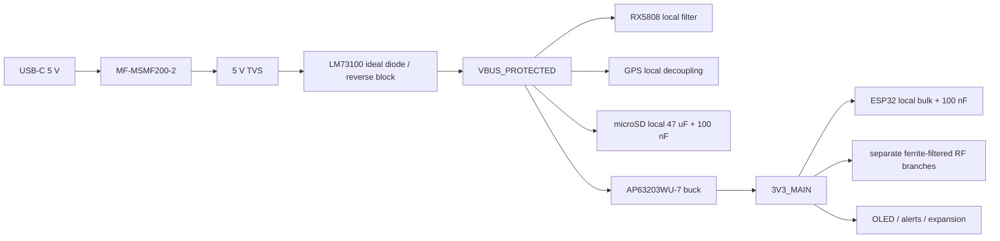

# SkySweep32 Pro Rev B power budget

Status: **DESIGN ANALYSIS — UNVALIDATED IN PHYSICAL HARDWARE — DO NOT ORDER**

This budget sizes the Rev B input path and 3.3 V regulator. Values are design
limits, not measured current. Bench measurements must replace them in the
bring-up report before any fabrication release.

## Input contract

* Input: one USB-C receptacle, 5.0 V nominal.
* Required source: a USB-C supply and cable explicitly rated for at least
  **5 V / 2 A**. A default-current computer port is not a full-load power source.
* CC1 and CC2 each have an independent 5.1 kΩ Rd. No USB-PD voltage above 5 V is
  requested or accepted.
* USB D+ and D− remain connected to GPIO19/GPIO20 for native programming/data.
* There is no onboard cell charger. `VBAT_ADC` is only a protected, high-
  impedance single-cell measurement input.

## Worst-case design load

The RF transceivers are passive receivers in the canonical profile, but their
supply branches are sized for the documented transmit transient. This prevents
a startup state or firmware fault from collapsing the rail. Countermeasure
hardware remains excluded.

### 3V3_MAIN

| Load | Design peak | Basis |
|---|---:|---|
| ESP32-S3-WROOM-1-N8 | 500 mA | Espressif supply-design allowance for RF transients |
| E01-ML01DP5 NRF24 PA/LNA | 130 mA | module transmit maximum; normal scan receive is much lower |
| E07-900M10S CC1101 | 50 mA | official maximum is 36 mA TX; branch includes reserve |
| Adafruit PID 3072 RFM95W | 130 mA | +20 dBm transmit transient |
| Adafruit PID 326 OLED | 50 mA | all-pixel/high-brightness allowance |
| CMT-1203 transducer + status LED | 45 mA | simultaneous audible/visual alert |
| Optional 310-101 vibration motor | 80 mA | running/start allowance; verify stall current on sample |
| Optional I2C expansion | 100 mA | connector allocation |
| Pull-ups, dividers and miscellaneous logic | 30 mA | board allowance |
| **3V3_MAIN total** | **1115 mA** | arithmetic sum |

The AP63203WU-7 rating is 2.0 A, leaving **885 mA / 44.3%** current margin over
the deliberately simultaneous load. Its official 3.3 V component set is used:
3.9 µH, 10 µF input, 2 × 22 µF output and 100 nF BST-SW. The selected
SRN6028-3R9M inductor has at least the datasheet-required current headroom and
less than 100 mΩ DCR; exact ratings are checked again against the supplier record
at BOM release.

### VBUS_PROTECTED and USB input

| Direct 5 V load | Design peak |
|---|---:|
| Qualified RX5808 module | 200 mA |
| Adafruit PID 746 GPS | 50 mA |
| Adafruit PID 254 microSD breakout | 200 mA |
| **Direct 5 V subtotal** | **450 mA** |

Using a deliberately conservative 85% buck efficiency,

$$I_{BUCK\_IN}=\frac{3.3\,V\times1.115\,A}{5.0\,V\times0.85}=0.866\,A$$

and the total USB design peak is

$$I_{USB}=0.450\,A+0.866\,A=1.316\,A.$$

A 15% source/cable/conversion reserve gives **1.51 A**, below the specified 2 A
input. The MF-MSMF200-2 2 A hold fuse is not used as a precision current limiter;
its trip curve and board temperature must be checked during bring-up.

## Power tree and locked implementation

1. `USB4105-GF-A` shell tabs bond to chassis/board ground with a short path.
2. `MF-MSMF200-2` is followed by the VBUS TVS and `LM73100RPWR`. The latter
   provides input reverse-polarity and output-to-input reverse-current blocking;
   its UVLO/OVLO and slew-rate components follow the TI design calculation.
3. `AP63203WU-7` follows the Diodes Incorporated reference layout. The VIN
   capacitor, IC, bootstrap capacitor, inductor and output capacitors form the
   smallest possible switching loop. The SW copper is kept small and away from
   GPS, both ADC inputs and antenna regions.
4. NRF24, CC1101 and LoRa receive individual ferrite-bead branches plus local
   100 nF and bulk capacitance. RX5808 receives its own filtered 5 V branch.
5. microSD has 47 µF plus 100 nF at the module connector to absorb write bursts.
6. Every removable module connector has a ground pin adjacent to supply where
   its native pinout permits. Supply and return widths are sized from the 2 A
   input / 1.175 A 3.3 V design currents, not from nominal receive current.

## Required bench evidence

The power design remains `UNVERIFIED` until the committed bring-up report records:

* USB inrush, steady state and worst transient at a 5 V / 2 A source;
* 3V3 minimum/maximum and ripple during simultaneous Wi-Fi, SD write and alerts;
* each RF module receive current and accidental-TX transient;
* AP63203 and inductor temperatures after a one-hour worst-case run;
* fuse and LM73100 voltage drop/temperature;
* RX5808 RSSI and VBAT ADC noise with buck, Wi-Fi and SD independently active.
