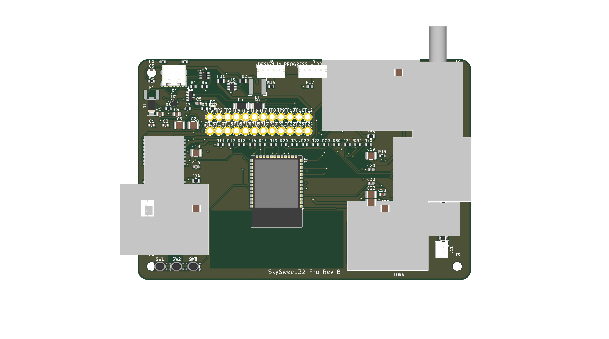

# SkySweep32 Pro Rev B Hardware Architecture

This directory contains the production **Rev B** carrier board design for **SkySweep32 Pro Tier**.

---

## Key Hardware Improvements (Rev A → Rev B)

1. **Integrated ESP32-S3 MCU**: Replaced generic DevKit module with an integrated **ESP32-S3-WROOM-1-N8** (8 MB flash, no PSRAM) to prevent strap-pin conflicts on GPIO35–37.
2. **Sub-GHz Transceiver Upgrade**: Replaced obsolete 433 MHz CC1101 module with Ebyte **E07-900M10S** (855–925 MHz SMD castellated module) with IPEX pigtail to panel SMA.
3. **Four-Layer PCB Architecture**: Stackup:
   - `L1 (F.Cu)`: High-speed signal routing and local power traces
   - `L2 (In1.Cu)`: Uninterrupted solid Ground plane (`GND`)
   - `L3 (In2.Cu)`: Split Power plane (`3V3_MAIN` / `VBUS_PROTECTED`)
   - `B.Cu`: Secondary signal routing
4. **Enhanced Power Management**:
   - TI **LM73100** eFuse protection (5.5 A, OVLO, UVLO, IMON)
   - Diodes Inc **AP63203WU-7** 2.0 A synchronous buck converter (3.3 V output, 44% headroom)
   - Dedicated low-pass RC filters on all RF power branches
5. **No Decorative SMA Connectors**: Every SMA bulkhead maps 1:1 to an active radio module.
6. **Sentinel Enclosure Rev B**: Precision CAD enclosure generated around the actual PCB assembly STEP model.

---

## File Inventory

| File / Path | Description |
|---|---|
| [`skysweep32_pro_rev_b.kicad_sch`](skysweep32_pro_rev_b.kicad_sch) | Native KiCad 10 schematic |
| [`skysweep32_pro_rev_b.kicad_pcb`](skysweep32_pro_rev_b.kicad_pcb) | Native 4-layer KiCad 10 PCB layout (fully routed) |
| [`generate_pcb.py`](generate_pcb.py) | Automated PCB generation and net-contract assertion script |
| [`build_case_rev_b.py`](build_case_rev_b.py) | FreeCAD Python 3D enclosure CAD synthesis script |
| [`skysweep32_pro_rev_b.step`](skysweep32_pro_rev_b.step) | 3D PCB Assembly STEP file (5.1 MB) |
| [`enclosures/skysweep32_pro_case_bottom_rev_b.stl`](enclosures/skysweep32_pro_case_bottom_rev_b.stl) | Sentinel Enclosure Bottom Case (3D Printable STL) |
| [`enclosures/skysweep32_pro_case_lid_rev_b.stl`](enclosures/skysweep32_pro_case_lid_rev_b.stl) | Sentinel Enclosure Top Lid Case (3D Printable STL) |
| [`HARDWARE_VALIDATION_REPORT.md`](HARDWARE_VALIDATION_REPORT.md) | Official PASS/FAIL verification matrix |

---

## Previews

### 3D PCB Assembly Preview


### Sentinel Enclosure
- Bottom case volume: **43 866.27 mm³**
- Lid case volume: **34 725.00 mm³**
- Wall thickness: **2.5 mm**
- Outer dimensions: **128 × 88 × 28.5 mm**

---

## Build & Synthesis Commands

Generate PCB baseline:
```bash
python hardware/rev_b/generate_pcb.py
```

Run KiCad DRC check:
```bash
kicad-cli pcb drc hardware/rev_b/skysweep32_pro_rev_b.kicad_pcb
```

Generate 3D Enclosure STEP/STL files:
```bash
python hardware/rev_b/build_case_rev_b.py
```
