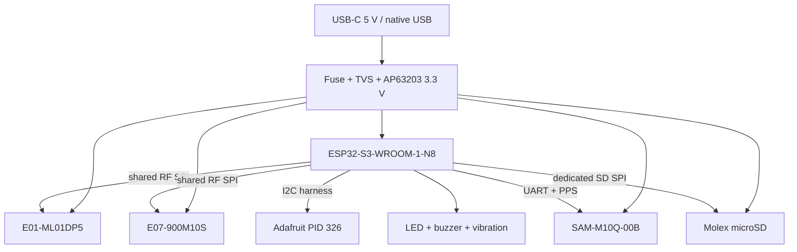

# SkySweep32 Rev C Architecture

**Status: READY FOR FIRST PHYSICAL PROTOTYPE — NOT PRODUCTION VALIDATED**

## Product definition

Rev C is a USB-powered passive RF activity monitor for an indoor/portable enclosure. It records energy/activity observations and received Remote ID messages; it does not identify arbitrary RF emitters from energy alone and it contains no active countermeasure output.

## Requirements matrix

| Function | Rev C requirement | Implementation | Evidence required before prototype release |
|---|---|---|---|
| 855–925 MHz | Channelized RSSI/activity | Exact Ebyte E07-900M10S, CC1101-compatible SPI, U.FL-to-panel-SMA pigtail | Datasheet pinout; schematic ERC; DRC; receive bench sweep after assembly |
| 2.4 GHz energy | Coarse channel activity | Exact Ebyte E01-ML01DP5, nRF24L01+ RPD | Datasheet pinout; schematic ERC; DRC; conducted/OTA receive comparison after assembly |
| Wi-Fi/BLE | Dashboard, ESP-NOW and experimental Remote ID reception | ESP32-S3-WROOM-1-N8 onboard antenna | Espressif antenna keepout; firmware build; reception test after assembly |
| 5.8 GHz | No unsupported claim | Not fitted or routed | Documentation and firmware must not advertise Rev C 5.8 GHz hardware |
| Position/time | NMEA UART and TIMEPULSE | u-blox SAM-M10Q-00B antenna module | UBX-22013293 / UBX-22020019 land pattern and keepout |
| UI | Readable removable display, status, user input | Lid-mounted Adafruit PID 326 OLED over keyed JST-PH; LED; button; buzzer; optional vibration | Harness pinout and enclosure fit check |
| Storage | Removable card with accessible insertion path | Molex 104031-0811 microSD socket on dedicated SPI | Molex drawing/KiCad footprint; enclosure card-access check |
| Power | One explicit source; safe protection; 3.3 V rail | USB-C 5 V/2 A, fuse, TVS, AP63203 2 A buck; no battery | Current budget; regulator reference design; current-limited bring-up |
| Programming | No external programmer required | ESP32-S3 native USB; BOOT/RESET; UART0 test pads | USB routing/ESD check; firmware upload smoke test after assembly |
| Assembly | Repeatable PCBA and serviceable enclosure | Four-layer PCB, replaceable E01 module, lid harness, panel antenna pigtails | Gerber/drill inspection; assembly STEP interference test |
| Environment | Portable indoor instrument | Printed two-part case; not sealed | CAD checks only; no IP or environmental claim |

Cost target is approximately USD 60–100 for one-off parts excluding assembly and printed enclosure. The RF modules and display are deliberately module-based because a direct multiband RF design would require controlled-impedance RF layout and test evidence unavailable before a first prototype. GNSS and microSD are direct components because their manufacturer land patterns and integration requirements are stable and this removes large breakout boards and ambiguous voltage-level circuitry.

## Functional architecture

## Interface contract

The reviewed pin contract lives in `hardware_manifest.json`; the firmware header and board definition are generated from it. RF1 and RF2 share SCK/MOSI/MISO but have independent chip selects. SD uses a separate SPI controller to isolate card write bursts from receiver traffic. GNSS uses UART plus a TIMEPULSE input. The display is the only I2C peripheral required by the base design.

ESP32-S3 strapping pins GPIO0, GPIO3, GPIO45 and GPIO46 are not assigned to peripherals. GPIO19/20 remain native USB. GPIO35–37 are valid only for the N8 non-octal-PSRAM module selected here; substituting an octal-flash/PSRAM variant is prohibited without a new pin review.

## Power architecture

The AP63203 rail is designed from the manufacturer application circuit, with a 3.9 µH inductor, local ceramic input/output capacitance and bulk capacitance at the module loads. The 2 A regulator rating is not the available continuous system current by itself; thermal performance, USB source, fuse and transient behavior still require physical testing.

| Load | Peak design current |
|---|---:|
| ESP32-S3 Wi-Fi/BLE burst | 500 mA |
| E01-ML01DP5 receive/transition allowance | 130 mA |
| E07-900M10S receive/transition allowance | 50 mA |
| SAM-M10Q acquisition allowance | 100 mA |
| microSD write burst | 200 mA |
| OLED, LED, buzzer and vibration logic | 70 mA |
| Margin and leakage | 50 mA |
| **Total** | **1,100 mA** |

The manifest currently records 1,050 mA because the vibration motor is externally powered from protected 5 V through a switched connector; the 3.3 V regulator calculation excludes motor current. Both rails require bench measurements during bring-up.

## RF interpretation limits

The E01 RPD bit only indicates received power above an approximate threshold; it is not RSSI and cannot classify a transmitter. The E07/CC1101 RSSI is useful for relative channel activity within the tuned 855–925 MHz range but does not prove protocol identity. Remote ID reception uses the ESP32 Wi-Fi/BLE stack and remains experimental until tested against known conforming transmitters.

## Mechanical rules

The lower-left PCB corner is the common datum. Mounting holes and 5 mm radial fastener/boss keepouts are fixed before placement. USB, microSD, BOOT/RESET, OLED harness and antenna pigtails are edge-constrained. The enclosure must be regenerated from the PCB assembly STEP and checked for component, fastener, plug, card, harness and lid collisions before `READY_FOR_PROTOTYPE` status is allowed.

## Source-of-truth hierarchy

1. Manufacturer datasheets and mechanical drawings define physical reality.
2. The reviewed KiCad schematic and PCB define the circuit and manufactured geometry.
3. `hardware_manifest.json` defines the cross-domain contract: exact MPNs, features, pin map, board datum and mechanical interfaces.
4. Firmware headers, PlatformIO board metadata, BOM exports, reports, renders and enclosure derivatives are generated evidence, not independent design authority.
5. Narrative documentation describes the above and never overrides failing machine evidence.
