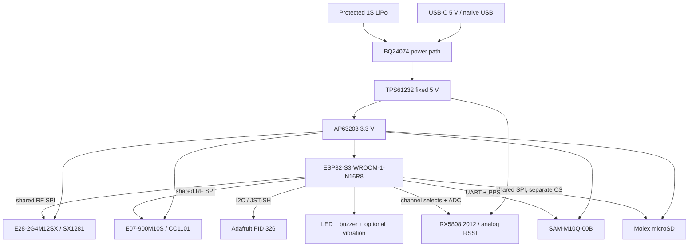

# SkySweep32 Rev C Architecture

**Status: READY FOR FIRST PHYSICAL PROTOTYPE — NOT PRODUCTION VALIDATED**

## Product definition

Rev C is a passive RF activity monitor and logger for an indoor portable
enclosure. It records channel energy/RSSI observations and received Wi-Fi/BLE
messages. Energy observations do not identify arbitrary emitters. Rev C has no
RF jamming, protocol-injection, GPS-denial, or other active-countermeasure
output.

## Requirements matrix

| Function | Rev C implementation | Evidence before first build | Physical evidence still required |
|---|---|---|---|
| 855–925 MHz | Ebyte `E07-900M10S`, CC1101-compatible SPI, carrier J5 edge-launch SMA | Datasheet pinout, ERC, DRC, routed PCBA STEP | Conducted channel/RSSI sweep with the selected regional antenna |
| 2.4 GHz energy | Ebyte `E28-2G4M12SX` / SX1281 instantaneous RSSI, onboard IPEX/U.FL and Adafruit PID 2308 internal antenna | Ebyte/Semtech pin contract, ERC, DRC, antenna/cable CAD envelope | Register identity, frequency sweep, RSSI response, and enclosure detuning test |
| 5.8 GHz energy | Qualified-envelope `RX5808-2012-12P`, eight hardware-selected channels, analog RSSI, J7 edge-launch SMA | Referenced 12-pad drawing, procurement restriction, ERC, DRC, antenna service envelope | Incoming inspection, pinout confirmation, channel truth table, RSSI response, and Taoglas `TG.59.0113` receive comparison |
| Wi-Fi/BLE | ESP32-S3 dashboard, ESP-NOW, and experimental Remote ID reception | Espressif keepout and firmware build | Reception/coexistence test; standards conformance is not established |
| Position/time | u-blox `SAM-M10Q-00B`, UART NMEA and TIMEPULSE | u-blox land pattern/integration review, ERC, DRC | Live fix, antenna status, and TIMEPULSE measurement |
| UI | Lid-mounted Adafruit PID 326 OLED on PID 4210 JST-SH cable; LED, buzzer, three buttons; optional DNP vibration output | Harness contract, button actuation and cable-length CAD checks | Pixel, button, visibility, buzzer, and repeated lid-service tests |
| Storage | Molex `104031-0811` removable microSD socket with card detect | Manufacturer footprint/model, ERC, DRC, card-removal envelope | Card detect, write/read verification, and repeated insertion |
| Power | USB-C or protected Adafruit PID 328 1S LiPo; BQ24074 power path; TPS61232 5 V boost; AP63203 3.3 V rail | Datasheet circuits, ERC, DRC, encoded 1.35 A peak budget | Current-limited bring-up, charge/power-path, ripple, transient, and thermal tests |
| Programming | ESP32-S3 native USB, BOOT/RESET, UART0 test pads | USB routing/ESD review and firmware build | Enumeration, upload, reconnect, and ESD robustness tests |
| Mechanical | 150 × 95 mm four-layer PCBA in generated two-part enclosure | Full PCBA STEP, battery/display/antenna/cable/fastener/service-envelope checks | First print, first PCBA, tolerance, cable dressing, and serviceability measurements |

The module-based receivers are deliberate first-prototype choices. A direct
multiband RF implementation would require RF characterization and manufacturing
controls that do not yet exist. The RX5808 source is the weakest procurement
item: only a 12-pad, 28 × 23 × 3 mm module matching the referenced drawing is
permitted, and the first received lot must be electrically and mechanically
qualified before assembly.

## Functional architecture

## Interface contract

The reviewed signal contract lives in `hardware_manifest.json`; the firmware
header and PlatformIO board definition derive from it. E28 and E07 share
SCK/MOSI/MISO and have independent chip selects. microSD uses the same physical
SPI signals with its own chip select. RX5808 uses three channel-select lines and
an analog RSSI path. GNSS uses UART plus TIMEPULSE. The display is on I2C.

GPIO0 is reserved for BOOT. GPIO3, GPIO45, and GPIO46 carry no peripheral load.
GPIO19/20 remain native USB. GPIO35–37 are reserved because the selected
`ESP32-S3-WROOM-1-N16R8` uses octal PSRAM. Substituting another ESP32-S3 module
variant requires a new schematic, pin-map, firmware, and layout review.

## Power architecture

USB VBUS is protected by the `MF-MSMF200-2` resettable fuse and `SMAJ5.0A` TVS;
USB D+/D− use `USBLC6-2SC6`. The `BQ24074RGTR` is configured for an 800 mA charge
current and 1.3 A input limit with a fixed 10 kΩ/10 kΩ battery-temperature
window. Use only the specified protected Adafruit PID 328 / LP785060 pack with
the documented JST-PH polarity.

`TPS61232DRCR` generates the switched 5 V system rail. `AP63203WU-7` generates
3.3 V through the reviewed `SRN6028-3R9M` inductor/application network. The
manifest's 1.35 A peak estimate covers ESP32 radio bursts, all three receiver
paths, GNSS acquisition, microSD writes, display/alerts, and margin. IC ratings
do not establish usable continuous current or thermal margin; both rails and the
charge/power-path behavior require first-board measurement.

## RF interpretation limits

- E28/SX1281 RSSI is channel energy, not protocol or transmitter identity.
- E07/CC1101 RSSI is relative activity within the configured 855–925 MHz range;
  Rev C must not issue a 433 MHz configuration.
- RX5808 analog RSSI is limited to the documented eight channel selections. Its
  module source and calibration remain unverified until incoming inspection and
  bench characterization.
- ESP32 Wi-Fi/BLE Remote ID reception remains experimental until tested against
  known conforming transmitters and a standards-conformance suite.

## Mechanical rules

The lower-left PCB corner is the shared datum. Mounting holes, 5 mm radial
fastener/boss keepouts, USB-C, microSD, both edge-launch SMA connectors, three
buttons, status LED, OLED, protected battery, and internal 2.4 GHz antenna are
manifest-defined interfaces. The enclosure generator consumes the complete PCBA
STEP and checks:

- base/lid/PCBA/OLED/battery/fastener/button collisions;
- USB cable, microSD card, SMA plug, and external antenna service volumes;
- closed and 30 mm-open OLED and internal-antenna cable routes against their
  exact 100 mm cable limits;
- battery-to-PCBA and floor clearances;
- button travel to switch contact.

Passing these checks means the modeled solids satisfy the encoded constraints.
It does not establish printed tolerances, connector mating force, antenna
performance, or physical serviceability.

## Source-of-truth hierarchy

1. Manufacturer datasheets and mechanical drawings define physical reality.
2. The reviewed KiCad schematic and PCB define the circuit and manufactured
   geometry.
3. `hardware_manifest.json` defines cross-domain exact MPNs, feature scope,
   firmware pins, board datum, assembly items, and mechanical interfaces.
4. Firmware headers, PlatformIO metadata, BOM/placement exports, reports,
   renders, enclosure derivatives, and manufacturing files are generated
   evidence, not independent design authority.
5. Narrative documentation describes those sources and never overrides failing
   machine evidence.
